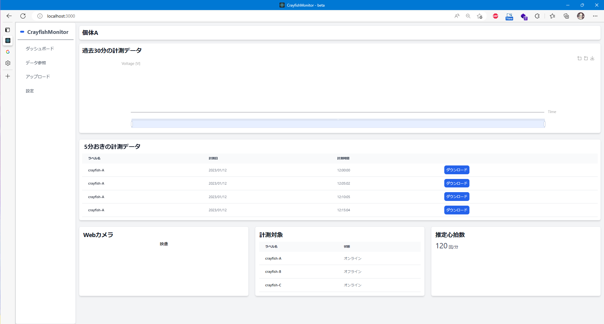
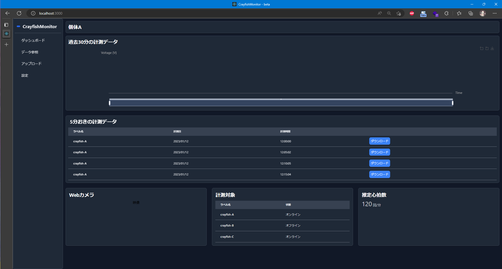

# NUCST-Project-FG2
日本大学理工学部物理学科 卒業研究リポジトリ
## 更新 (2023/1/26)

CrayfishMonitor を Web 版へ移行中です。

ダークモード対応

## Arduino のプログラム
ADS1115 のADコンバータ用にプログラムを修正しました。 
`AD_Converter_ADS1115` は ADS1115 用のプログラム、`AD_Converter` は Arduino で AD 変換するためのプログラムです。
