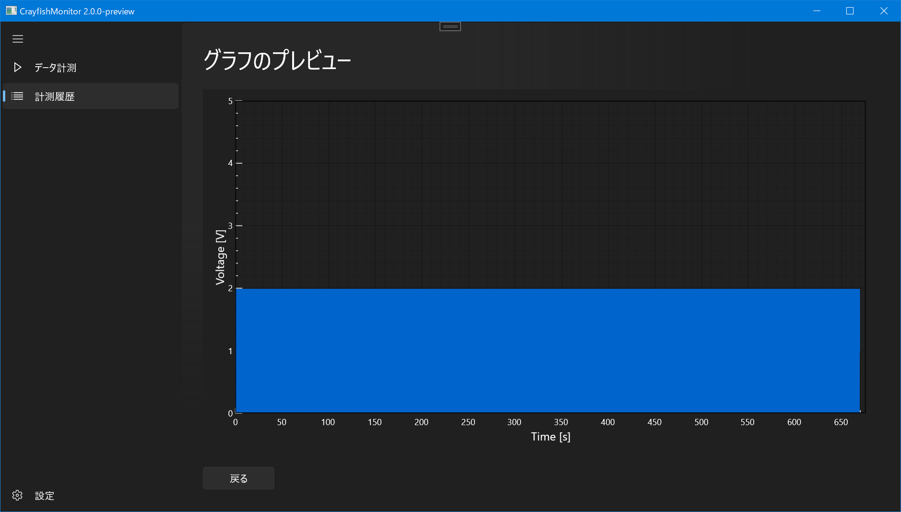
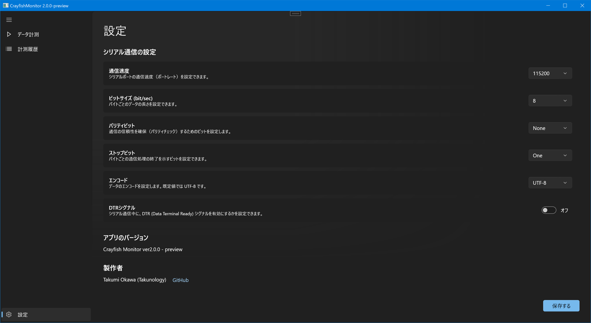

# NUCST-CrayfishMonitor
日本大学理工学部物理学科 卒業研究用リポジトリ

物理学プロジェクト実験から継承しています。
## 更新情報 (2022/4/30)

- Windows App SDK 1.0.3 へ更新
- 測定したデータをグラフでプレビューする機能の実装
- 設定画面の実装（今の時点では設定値は更新できません）
- 計測しながら他の作業が可能になりました（計測中に履歴データを確認したり、削除したりが可能）

随時機能を追加していきます。

計測したデータのグラフプレビュー

設定画面

