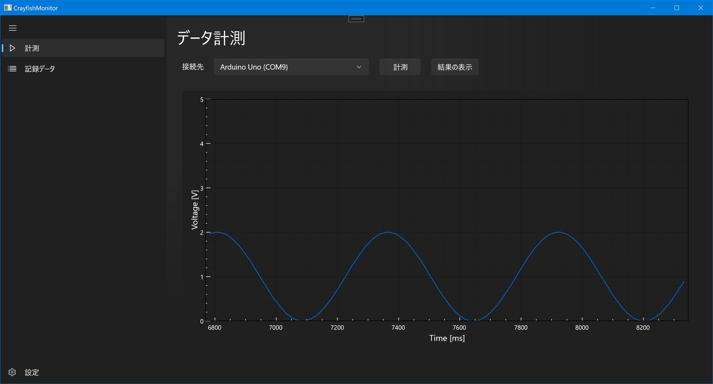

# NUCST-CrayfishMonitor
日本大学理工学部物理学科 卒業研究用リポジトリ

物理学プロジェクト実験から継承しています。
## 更新情報 (2022/4/17)

- WinUI3 / Windows App SDK 1.0.2 へ移植中
- シリアル通信によるグラフ描画まで完了
- 1ms 単位でデータを受信できるようになった（高速化を行った）
- アプリがフリーズしにくくなった（最適化を行った）

随時機能を追加していきます。

描画している様子

