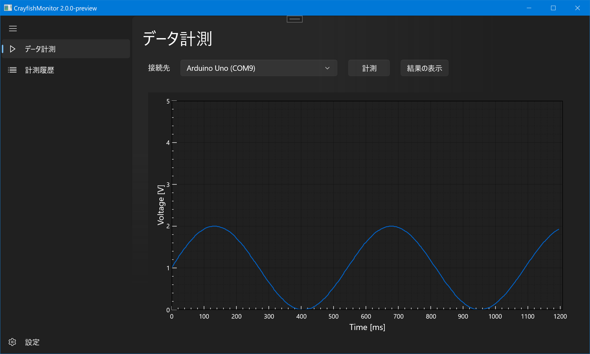
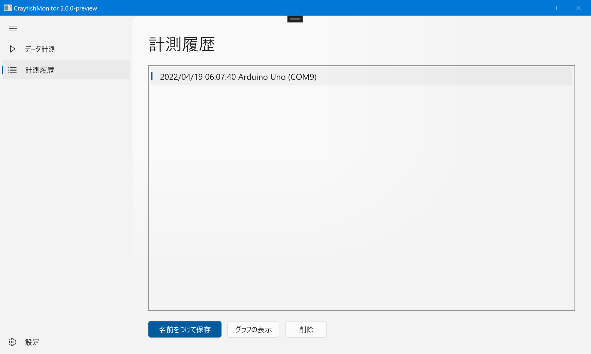
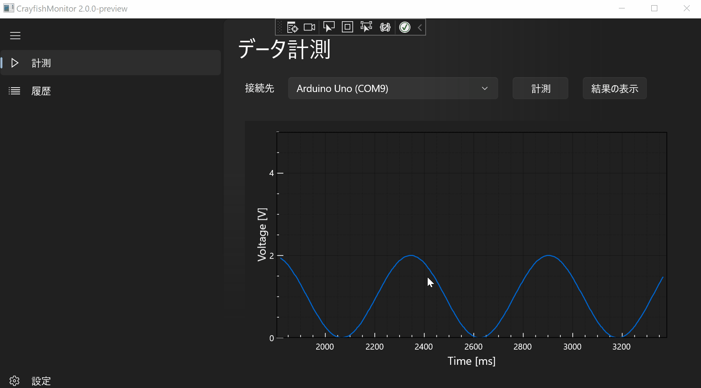

# NUCST-CrayfishMonitor
日本大学理工学部物理学科 卒業研究用リポジトリ

物理学プロジェクト実験から継承しています。
## 更新情報 (2022/4/19)

- WinUI3 / Windows App SDK 1.0.2 へ移植中
- 測定を履歴として残しておく機能の実装
- 測定データの削除機能を実装
- CSV保存（書き出し）機能の実装

随時機能を追加していきます。

システムのテーマカラー（ダークモード）に対応しているのは、WinUI3 のデフォルト機能による。

測定値の描画

データの保存

