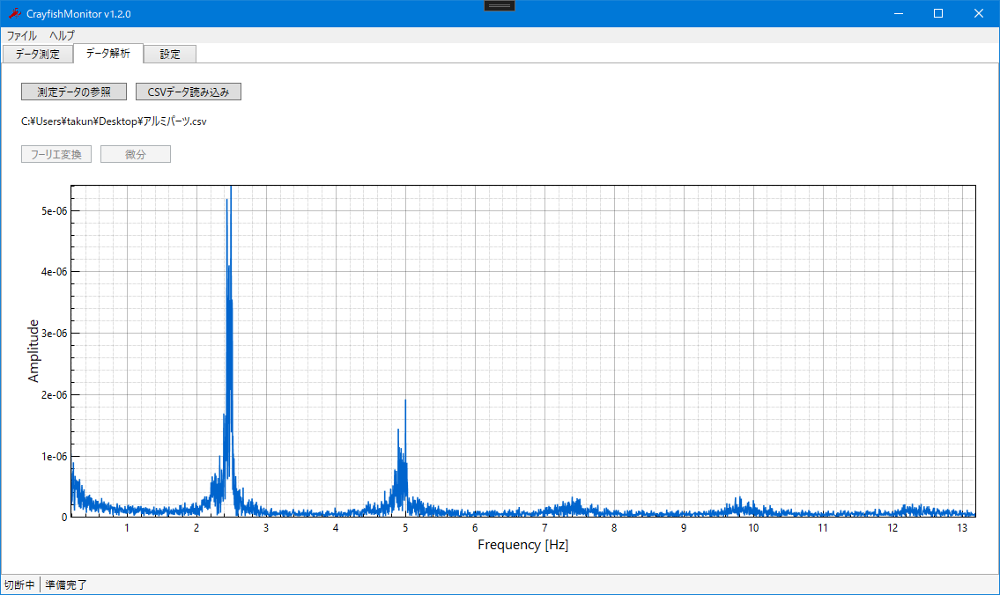

# NUCST-Project-FG2
日本大学理工学部物理学科 物理学プロジェクト実験用リポジトリ
## 更新 (2021/11/9)

CrayfishMonitor 1.2.0 のリリース版です。下記のような変更を行いました。いくつかの保存機能は未実装です。 

 - .NET 6 への移行
 - フーリエ変換機能（窓関数未実装）
 - 微分機能
 - CSVファイルの読み込み

このアプリを動かすにはランタイムパッケージ [.NET 6](https://dotnet.microsoft.com/download/dotnet/6.0) が必要です。

## Arduino のプログラム
ADS1115 のADコンバータ用にプログラムを修正しました。 
`AD_Converter_ADS1115` は ADS1115 用のプログラム、`AD_Converter` は Arduino で AD 変換するためのプログラムです。