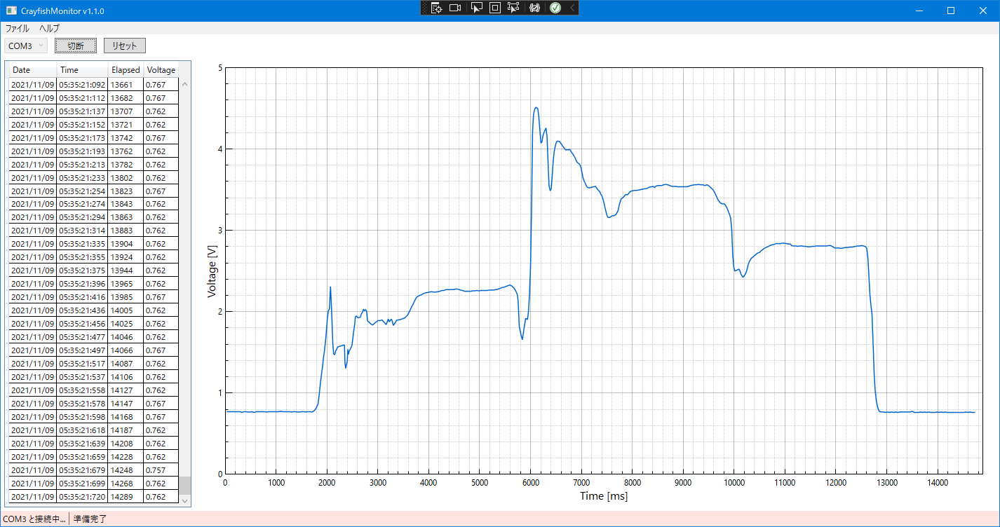
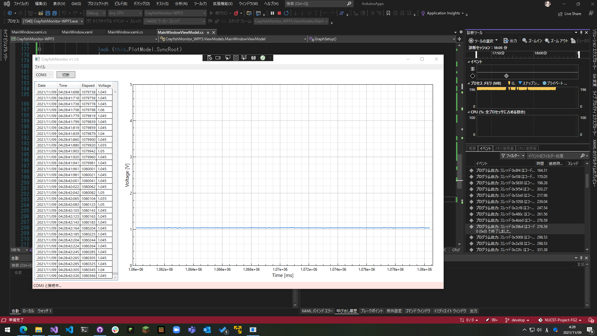

# NUCST-Project-FG2
日本大学理工学部物理学科プロジェクト実験用のリポジトリです。主な用途としては、ソースコードの管理と共有です。

- Arduino のA/D変換用プログラム
- データ収集用プログラム
- 報告書作成用の LaTeX コード

などを保存する予定です。
## 更新 (2021/11/9)

CrayfishMonitor 1.1.0 のリリース版です。下記のような変更を行いました。

 - .NET 5 への移行
 - MVVM デザインパターンの適用
 - 一部 UI の変更
 - グラフの初期値Y軸を 0 - 5V に固定（可変）

このアプリを動かすにはランタイムパッケージ [.NET 5](https://dotnet.microsoft.com/download/dotnet/5.0) が必要です。Linux や Mac でも動かせるはずですが、まだ確認はできていません。

 

画像の通り、18ほどデータを記録してもフリーズせずに動作していました。10万ほどのデータ数の記録と、20ミリ秒間隔でのデータ受信をリアルタイムに行っているので、Arduino と接続している間は動作が重いです。