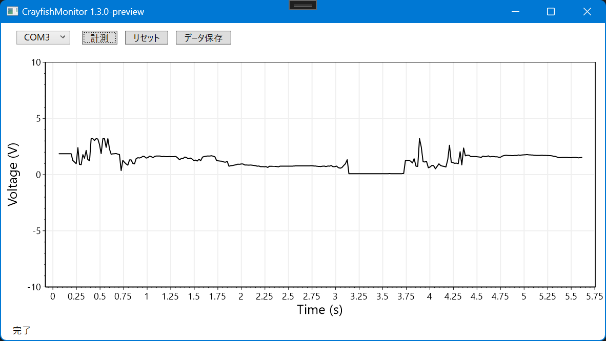

# NUCST-Project-FG2
日本大学理工学部物理学科 アプリ開発用リポジトリ（プロジェクト実験より継承）
## 更新 (2022/11/25)

CrayfishMonitor 1.3.0 のプレビュー版です。下記のような変更を行いました。

 - OxyPlot から ScottPlot への変更

このアプリを動かすにはランタイムパッケージ [.NET 6](https://dotnet.microsoft.com/download/dotnet/6.0) が必要です。

## Arduino のプログラム
ADS1115 のADコンバータ用にプログラムを修正しました。 
`AD_Converter_ADS1115` は ADS1115 用のプログラム、`AD_Converter` は Arduino で AD 変換するためのプログラムです。
