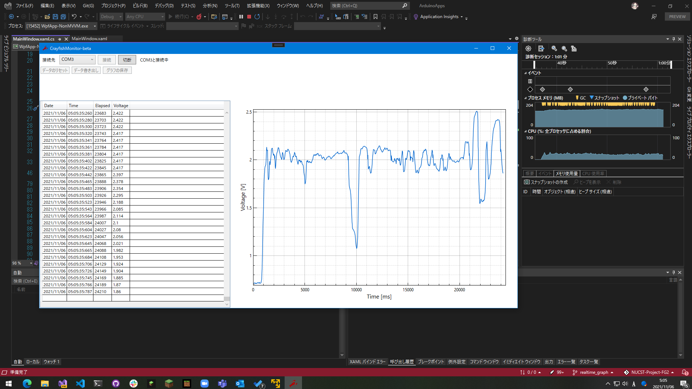

# NUCST-Project-FG2
日本大学理工学部物理学科プロジェクト実験用のリポジトリです。主な用途としては、ソースコードの管理と共有です。

- Arduino のA/D変換用プログラム
- データ収集用プログラム
- 報告書作成用の LaTeX コード

などを保存する予定です。

## 更新 (2021/11/6)
リアルタイムにデータを記録できるアプリ CrayfishMonitor です。
 
 - Arduinoからのデータ受信
 - データの保存 (CSV形式)
 - リアルタイムなグラフ描画
 - グラフ画像の保存

が行えます。

モニタリングシステムとしてのリリース版です。このアプリを動かすにはランタイムパッケージ [.NET Core 3.1](https://dotnet.microsoft.com/download/dotnet/3.1) が必要です。Linux や Mac でも動かせるはずですが、まだ確認はできていません。

 

動いている様子は Google ドライブにて共有しています。