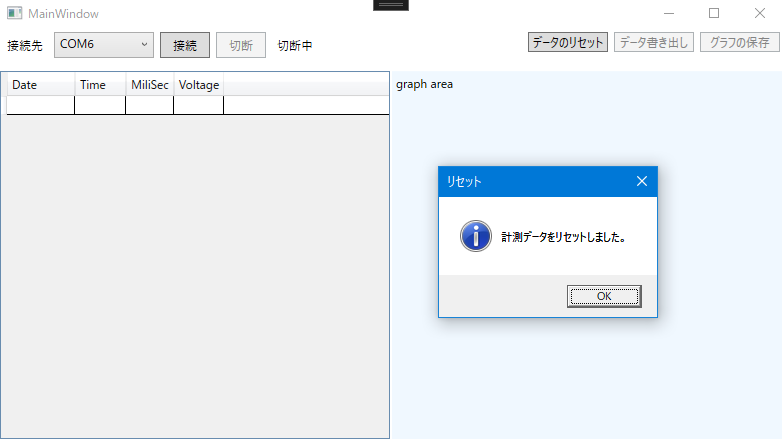

# NUCST-Project-FG2
日本大学理工学部物理学科プロジェクト実験用のリポジトリです。主な用途としては、ソースコードの管理と共有です。

- Arduino のA/D変換用プログラム
- データ収集用プログラム
- 報告書作成用の LaTeX コード

などを保存する予定です。

## 更新 (2021/10/13 )
Arduinoとのシリアル通信およびデータ取得が行えるようになりました。また、取得したデータをリセットする実装も行いました。（まだ保存はできません。）

50ミリ秒につき1ミリ秒の遅延があるようです。

